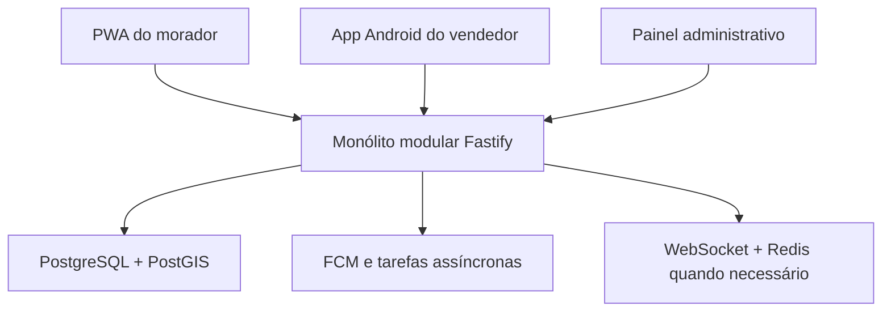

# Arquitetura do piloto

## 1. Objetivo

Construir uma plataforma de dois lados que responda rapidamente:

- Morador: “Quem está passando perto de mim e quando pode chegar?”
- Vendedor: “Onde existe demanda suficiente para eu ajustar minha rota?”

O protótipo aprovado continua concentrando a PWA do morador e o painel administrativo em Vinext. A fundação técnica acrescenta uma API Fastify, contratos compartilhados, domínio testável, aplicativo Android inicial e PostgreSQL/PostGIS local. Os dados visíveis permanecem simulados até a integração segura dos fluxos reais.

## 2. Visão de componentes



## 3. Aplicações

### PWA do morador

- Descoberta sem cadastro obrigatório.
- Pesquisa por vendedor, produto ou categoria.
- Localização aproximada dos vendedores ativos.
- Favoritos e alertas de aproximação.
- Solicitação com produto, quantidade, janela de espera e ponto seguro.
- Acompanhamento do aceite e da aproximação.

### Aplicativo Android do vendedor

- Perfil, catálogo e pagamentos aceitos.
- Modo rota explícito e visível.
- Envio de posição apenas durante o trabalho.
- Solicitações próximas e zonas de demanda.
- Aceite, recusa, chegada e conclusão do atendimento.
- Operação resiliente a perda temporária de sinal.
- Alertas por áudio e controles grandes para reduzir distração.

### Painel administrativo

- Aprovação e verificação de vendedores.
- Categorias, cidades e bairros.
- Denúncias, bloqueios e suspensões.
- Indicadores de ativação, aceite e atendimento.
- Auditoria de ações sensíveis.
- Política de retenção de localização.

## 4. Backend

Stack adotada:

- Node.js + TypeScript + Fastify.
- PostgreSQL + PostGIS.
- WebSocket para eventos ativos.
- Firebase Cloud Messaging para notificações push.
- Cloud Storage para documentos de verificação no piloto hospedado.
- Redis somente quando volume, filas ou presença distribuída justificarem.

Módulos de domínio:

1. Identidade e acesso.
2. Vendedores e verificação.
3. Catálogo e categorias.
4. Rotas e presença.
5. Solicitações e atendimentos.
6. Favoritos e notificações.
7. Denúncias e moderação.
8. Métricas e auditoria.

### Identidade do piloto

- Google Identity Platform/Firebase Authentication emite o token do usuário.
- A API valida assinatura, emissor e audiência por OIDC/JWKS.
- Nenhuma senha é armazenada no banco do TE Vi na TV.
- O PostgreSQL mantém o papel operacional (`customer`, `seller`, `admin`) e o estado da conta.
- Todo novo usuário começa como morador; o papel de vendedor é concedido somente após aprovação administrativa.

## 5. Modelo de dados inicial

| Entidade | Responsabilidade |
|---|---|
| `users` | Identidade base e papéis |
| `seller_profiles` | Dados públicos e estado de verificação |
| `products` | Catálogo simplificado do vendedor |
| `route_sessions` | Início e encerramento consciente da rota |
| `seller_positions` | Posições temporárias com retenção curta |
| `service_requests` | Interesse do morador e ciclo do atendimento |
| `safe_meeting_points` | Referências seguras sem exposição pública |
| `favorites` | Relação morador–vendedor |
| `notifications` | Entregas push e preferências |
| `reports` | Denúncias e decisões de moderação |
| `audit_events` | Evidência das ações sensíveis |

Estados da solicitação:

```text
PENDING → ACCEPTED → ON_THE_WAY → ARRIVED → COMPLETED
        ↘ DECLINED
        ↘ EXPIRED
ACCEPTED/ON_THE_WAY → CANCELLED
```

## 6. Eventos em tempo real

- `seller.route.started`
- `seller.position.updated`
- `seller.route.stopped`
- `request.created`
- `request.accepted`
- `request.declined`
- `request.expired`
- `request.status.changed`
- `seller.nearby`

As posições não devem ser gravadas indefinidamente. O estado público pode usar coordenadas arredondadas ou deslocadas e uma janela curta de validade.

## 7. Segurança e LGPD

- Consentimento granular para localização.
- Indicador permanente enquanto o vendedor transmite posição.
- Encerramento automático por inatividade configurável.
- Endereço do morador nunca publicado no mapa.
- Coordenada precisa entregue apenas quando necessária ao atendimento aceito.
- Criptografia em trânsito e em repouso.
- Perfis administrativos com menor privilégio.
- Registro de acesso a documentos e ações de moderação.
- Política explícita de exclusão e retenção.

## 8. Hospedagem escalável

| Componente | Serviço alvo | Estratégia |
|---|---|---|
| PWA e painel | Sites nesta demonstração; Cloud Run/CDN no piloto | Conteúdo público distribuído e implantação versionada |
| API | Cloud Run em `southamerica-east1` | Escala horizontal com limite de instâncias |
| Banco | Cloud SQL PostgreSQL + PostGIS | Backups, alta disponibilidade futura e conexão privada |
| Arquivos | Cloud Storage | Acesso temporário e auditável |
| Notificações | Firebase Cloud Messaging | Envio somente pelo backend |
| Segredos | Secret Manager | Nenhum segredo no repositório ou APK |
| Tarefas | Cloud Tasks | Expiração, notificações e rotinas assíncronas |
| Redis | Memorystore, somente quando necessário | Sincronização de WebSocket entre instâncias |

O piloto começa como monólito modular. A API não mantém sessão em memória e poderá receber novas instâncias sem alterar os clientes. O número máximo de instâncias será limitado para proteger custo e conexões do banco.

## 9. Ambientes

| Ambiente | Uso | Dados |
|---|---|---|
| Desenvolvimento | Implementação local | Simulados |
| Demonstração | Validação de interface | Simulados |
| Piloto | Operação controlada em Santo André | Reais e limitados |

O ambiente de demonstração nunca deve chamar serviços de localização ou notificação reais.

## 10. Organização atual do código

```text
app/                     PWA do morador e painel administrativo
apps/
  seller-mobile/         Aplicativo Android Expo
services/
  api/                   API Fastify e OpenAPI
packages/
  contracts/             Contratos TypeBox compartilhados
  domain/                Regras de negócio sem infraestrutura
infra/
  database/              PostGIS local e migrações
docs/
```

A separação física da PWA e do painel em aplicações independentes será feita somente quando houver uma necessidade operacional clara. Nesta fase, compartilhar a aplicação web reduz duplicação sem misturar as permissões do backend.

## 11. Estado desta entrega

Implementado:

- workspaces para API, aplicativo móvel, contratos e domínio;
- API com health check, OpenAPI, CORS restrito, logs com campos sensíveis ocultos e validação OIDC;
- registro persistente de conta e atualização do perfil do morador;
- solicitação, revisão e aprovação de cadastro de vendedor com auditoria;
- criação, edição, listagem e remoção de itens do catálogo;
- contratos dos estados de solicitação, rota, coordenadas e erros;
- máquina de estados testada e utilitários de validade/precisão pública da posição;
- esquema PostgreSQL/PostGIS inicial;
- aplicativo Android demonstrativo no visual Bairro Vivo;
- pipeline de validação no GitHub.
- simulação integrada no navegador entre morador, vendedor e administração;
- ciclo completo demonstrável: envio, aceite, deslocamento, chegada, conclusão, cancelamento e avaliação;
- Modo Rota demonstrativo com pausa, retomada, categorias e formas de recebimento;
- estado local do cenário restrito ao aparelho, sem API, GPS ou dados pessoais reais.

Ainda não ativado:

- projeto do Google Identity Platform e ambiente Cloud SQL do piloto;
- coleta de GPS;
- persistência de servidor do fluxo “Quero que passe” (a demonstração usa apenas estado local no aparelho);
- WebSocket, FCM e Redis;
- documentos reais de vendedores.
