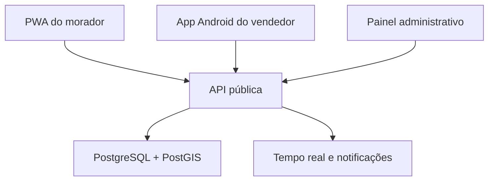

# Arquitetura do piloto

## 1. Objetivo

Construir uma plataforma de dois lados que responda rapidamente:

- Morador: “Quem está passando perto de mim e quando pode chegar?”
- Vendedor: “Onde existe demanda suficiente para eu ajustar minha rota?”

O protótipo deste repositório concentra as três interfaces em Vinext para acelerar a validação visual. A arquitetura abaixo é o destino recomendado para o piloto com usuários reais.

## 2. Visão de componentes



## 3. Aplicações

### PWA do morador

- Descoberta sem cadastro obrigatório.
- Pesquisa por vendedor, produto ou categoria.
- Localização aproximada dos vendedores ativos.
- Favoritos e alertas de aproximação.
- Solicitação com produto, quantidade, janela de espera e ponto seguro.
- Acompanhamento do aceite e da aproximação.

### Aplicativo Android do vendedor

- Perfil, catálogo e pagamentos aceitos.
- Modo rota explícito e visível.
- Envio de posição apenas durante o trabalho.
- Solicitações próximas e zonas de demanda.
- Aceite, recusa, chegada e conclusão do atendimento.
- Operação resiliente a perda temporária de sinal.
- Alertas por áudio e controles grandes para reduzir distração.

### Painel administrativo

- Aprovação e verificação de vendedores.
- Categorias, cidades e bairros.
- Denúncias, bloqueios e suspensões.
- Indicadores de ativação, aceite e atendimento.
- Auditoria de ações sensíveis.
- Política de retenção de localização.

## 4. Backend

Stack recomendada:

- Node.js + TypeScript + Fastify.
- PostgreSQL + PostGIS.
- WebSocket para eventos ativos.
- Firebase Cloud Messaging para notificações push.
- Armazenamento de objetos compatível com S3 para documentos de verificação.
- Redis somente quando volume, filas ou presença distribuída justificarem.

Módulos de domínio:

1. Identidade e acesso.
2. Vendedores e verificação.
3. Catálogo e categorias.
4. Rotas e presença.
5. Solicitações e atendimentos.
6. Favoritos e notificações.
7. Denúncias e moderação.
8. Métricas e auditoria.

## 5. Modelo de dados inicial

| Entidade | Responsabilidade |
|---|---|
| `users` | Identidade base e papéis |
| `seller_profiles` | Dados públicos e estado de verificação |
| `products` | Catálogo simplificado do vendedor |
| `route_sessions` | Início e encerramento consciente da rota |
| `seller_positions` | Posições temporárias com retenção curta |
| `service_requests` | Interesse do morador e ciclo do atendimento |
| `safe_meeting_points` | Referências seguras sem exposição pública |
| `favorites` | Relação morador–vendedor |
| `notifications` | Entregas push e preferências |
| `reports` | Denúncias e decisões de moderação |
| `audit_events` | Evidência das ações sensíveis |

Estados da solicitação:

```text
PENDING → ACCEPTED → ON_THE_WAY → ARRIVED → COMPLETED
        ↘ DECLINED
        ↘ EXPIRED
ACCEPTED/ON_THE_WAY → CANCELLED
```

## 6. Eventos em tempo real

- `seller.route.started`
- `seller.position.updated`
- `seller.route.stopped`
- `request.created`
- `request.accepted`
- `request.declined`
- `request.expired`
- `request.status.changed`
- `seller.nearby`

As posições não devem ser gravadas indefinidamente. O estado público pode usar coordenadas arredondadas ou deslocadas e uma janela curta de validade.

## 7. Segurança e LGPD

- Consentimento granular para localização.
- Indicador permanente enquanto o vendedor transmite posição.
- Encerramento automático por inatividade configurável.
- Endereço do morador nunca publicado no mapa.
- Coordenada precisa entregue apenas quando necessária ao atendimento aceito.
- Criptografia em trânsito e em repouso.
- Perfis administrativos com menor privilégio.
- Registro de acesso a documentos e ações de moderação.
- Política explícita de exclusão e retenção.

## 8. Ambientes

| Ambiente | Uso | Dados |
|---|---|---|
| Desenvolvimento | Implementação local | Simulados |
| Demonstração | Validação de interface | Simulados |
| Piloto | Operação controlada em Santo André | Reais e limitados |

O ambiente de demonstração nunca deve chamar serviços de localização ou notificação reais.

## 9. Organização futura do código

```text
apps/
  customer-pwa/
  seller-mobile/
  admin-web/
services/
  api/
packages/
  contracts/
  domain/
  design-system/
  observability/
infra/
  database/
  deployment/
docs/
```

Esta separação deve ocorrer somente quando o fluxo visual estiver aprovado e a validação em campo confirmar os comportamentos essenciais.
